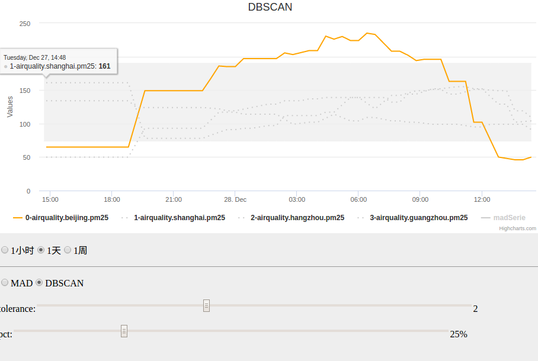
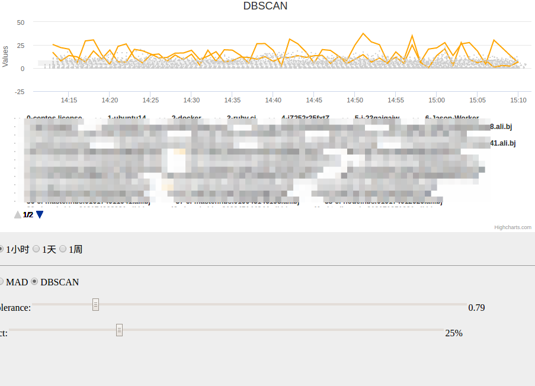

# 异常指标检测

> 怎么从一些列指标曲线里找到和其它的明显不一样的曲线？

**场景1：**

北京的 PM2.5 明显和别的几个城市不一样

**场景2：**

用户抱怨线上慢，但是究竟是那个主机 CPU 异常导致的呢

## 目前有两种算法

### MAD 中位数绝对值偏差

对应的 JavaScript 实现

[MAD in mathjs](http://mathjs.org/docs/reference/functions/mad.html)

### DBSCAN 基于密度的聚类算法

对应的 JavaScript 实现

[DBSCAN in JavaScript](https://github.com/uhho/density-clustering#dbscan-1)
